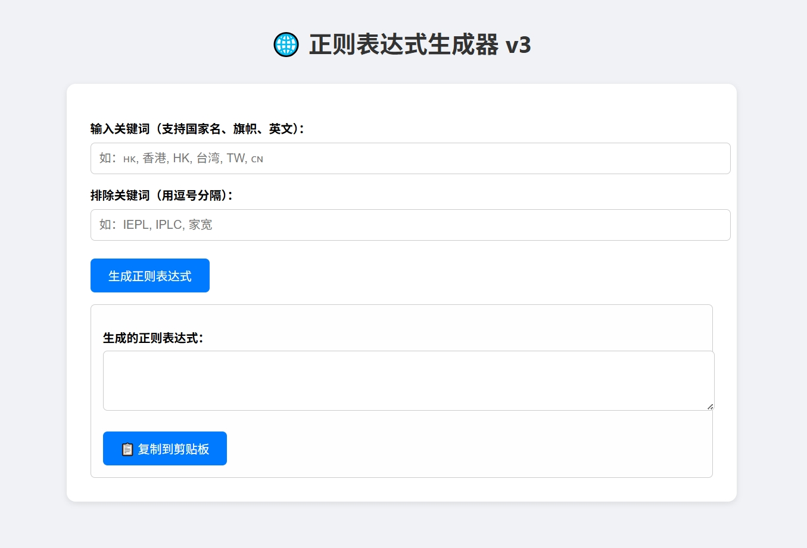

# 🎯 Regex Generator 

一个简洁美观的网页工具，用于根据关键词自动生成正则表达式，方便快速筛选机场节点（支持中文、国旗 Emoji、英文缩写等格式）。✨

## 🧠 功能特色

- ✅ 支持**中文关键词**（如：香港、台湾）
- ✅ 支持**旗帜 Emoji**（如：🇭🇰、🇹🇼）
- ✅ 支持**英文缩写**（如：HK、TW、JP）
- ✅ 支持**排除关键词**（如：家宽、IEPL、IPLC）
- ✅ 一键生成符合 v3 规范的标准正则表达式
- ✅ 页面布局清爽，适合长期使用或收藏

## 🚀 使用方法

1. 打开 `index.html`（支持本地浏览器直接打开，无需服务器）
2. 在对应输入框中填写关键词：
   - 中文关键词（用 `,` 分隔）
   - Emoji 旗帜关键词（用 `,` 分隔）
   - 英文关键词（用 `,` 分隔）
   - 可选：排除关键词
3. 点击【生成正则表达式】按钮
4. 在下方输出框中复制结果即可使用

### 🔍 正则格式示例

^(?=.(?:香港|台湾))(?=.(?:🇭🇰|🇹🇼))(?=.(?i:\b(?:HK|TW)(?:\d+)?\b))(?!.(?:IEPL|IPLC|家宽)).*$

## 💡 应用场景

- 🧪 筛选科学上网节点（如 Shadowrocket、Clash、Loon）
- 🔍 在配置文件中精准定位某类节点
- 🛠️ 搭配去重、归类工具进一步处理节点数据
